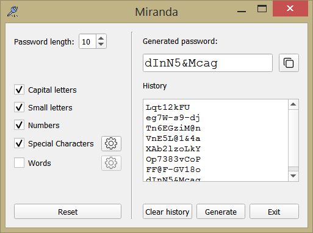
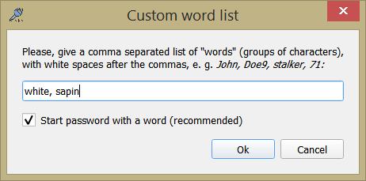
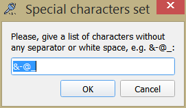

# Miranda

Miranda is a random password generator. A distinctive feature of Miranda compared to classical generators is that it allows you to personalize a set of special characters, as well as insert whole words (i.e. groups of characters). If included, the words can appear in the password randomly or semi-randomly, depending on the strategy chosen by the user.

 &nbsp; &nbsp; &nbsp; &nbsp; 
 
Generated passwords are displayed in the field "History", which can be cleared at will. 
The last generated password can be copied to the clipboard by clicking on the button provided for this purpose. 
The "Reset" button restores the default settings.
